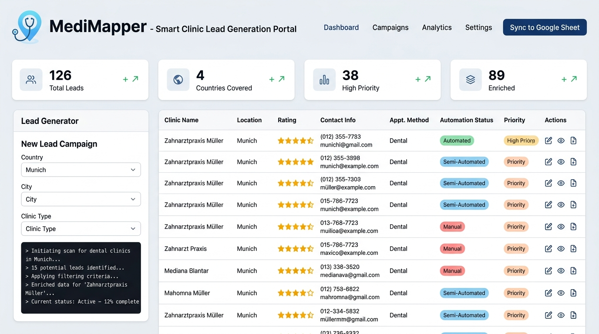
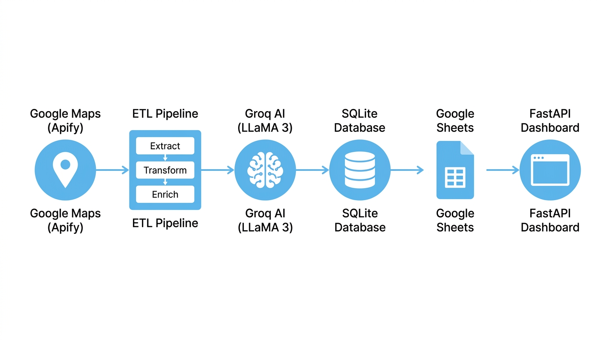
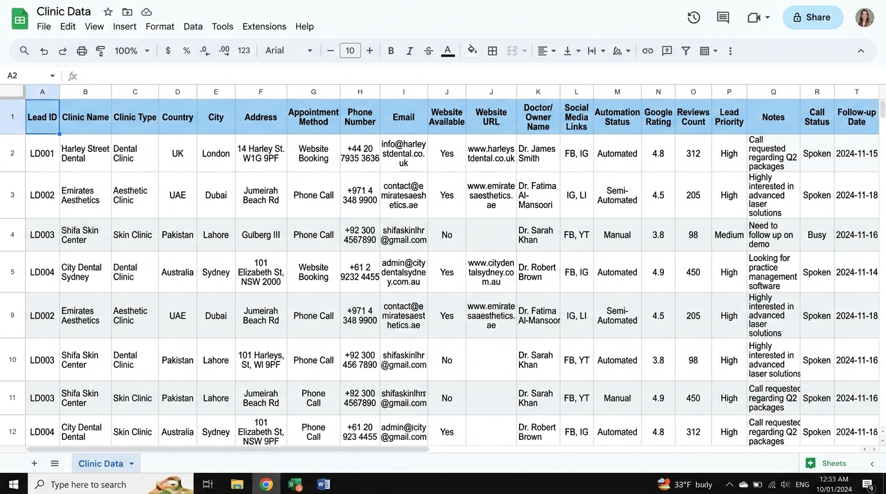

<h1 align="center">
  
  <br/>
  MediMapper
</h1>

<p align="center">
  A smart clinic lead generation agent that automatically collects, enriches, and exports verified clinic data from multiple countries into Google Sheets with a real-time dashboard.
</p>

<p align="center">
  
  
  
  
  
  
  
  
</p>

---

## Overview

MediMapper is a fully automated lead generation pipeline built for clinic businesses. It scrapes Google Maps for clinic listings across multiple countries, visits each clinic website to extract contact and operational data, uses Groq AI to classify appointment methods and automation status, and exports everything into a structured Google Sheet. A live web dashboard provides real-time visibility and control over the entire process.

---

## System Pipeline

<p align="center">
  
</p>

The pipeline runs in four stages:

1. **Extract** - Apify Google Maps Scraper fetches clinic listings by city and type
2. **Transform** - Clinic websites are scraped with a custom HTML parser to pull emails, phone numbers, social links, and booking pages
3. **Enrich** - Groq AI (LLaMA 3.1) analyzes the scraped content to classify appointment method and automation status
4. **Load** - Clean data is saved to SQLite and automatically synced to Google Sheets

---

## Features

- Scrapes Google Maps listings using Apify for clinics across UK, UAE, Pakistan, and Australia
- Visits each clinic website to extract real emails, phone numbers, social media links, and booking URLs
- Classifies appointment method: Phone, WhatsApp, Website Booking, Online System, Walk-in
- Classifies automation status: Manual, Semi-Automated, Automated
- Detects and assigns lead priority (High, Medium, Low) based on Google rating
- Deduplication prevents the same clinic from being added twice
- Auto-syncs to Google Sheets after every extraction run
- Weekly scheduled automation via Celery Beat (every Monday 9 AM UTC)
- Interactive web dashboard with live stats, search, filters, and execution logs
- REST API for all operations including manual triggers

---

## Dashboard

<p align="center">
  
</p>

The dashboard is served from the FastAPI backend and provides:

- Real-time stats cards: total leads, countries covered, high-priority count, enriched leads
- Interactive data table with search and filters by country, priority, and automation status
- Lead Generator panel with linked country/city dropdowns
- Live terminal log window showing scraping progress
- One-click Google Sheets sync button
- Detailed view modal for each lead with full contact and clinic info

---

## Google Sheets Export

<p align="center">
  
</p>

Every extraction auto-syncs to your connected Google Sheet with 20 structured columns:

| Column | Description |
|--------|-------------|
| Lead ID | Unique database identifier |
| Clinic Name | Full clinic name from Google Maps |
| Clinic Type | Category (Dental, Skin, Aesthetic, etc.) |
| Country | UK, UAE, Pakistan, Australia |
| City | City extracted from search |
| Address | Full address string |
| Appointment Method | Phone / WhatsApp / Website Booking / Online System |
| Phone Number | Extracted from Maps or website |
| Email | Scraped from clinic website |
| Website Available | Yes / No |
| Website URL | Direct link to clinic website |
| Doctor/Owner Name | Extracted by AI from website content |
| Social Media Links | Instagram, Facebook URLs |
| Automation Status | Manual / Semi-Automated / Automated |
| Google Rating | Star rating from Maps |
| Reviews Count | Total review count |
| Lead Priority | High / Medium / Low |
| Notes | Internal notes field |
| Call Status | New (default) |
| Follow-up Date | Scheduled follow-up date |

---

## Tech Stack

| Layer | Technology |
|-------|-----------|
| Web Framework | FastAPI |
| Task Queue | Celery + Redis |
| Scheduler | Celery Beat |
| Database | SQLite via SQLAlchemy |
| Scraping | Apify Google Maps Scraper |
| Website Parser | Python html.parser + requests |
| AI Enrichment | Groq API (LLaMA 3.1 8B Instant) |
| Sheets Integration | gspread + Google Service Account |
| Frontend | Vanilla HTML, CSS, JavaScript |
| Icons | Font Awesome 6 |
| Fonts | Google Fonts (Outfit) |

---

## Project Structure

```
clinic-lead-gen/
├── main.py              # FastAPI app, API routes, static file serving
├── etl.py               # Extract, Transform, Enrich pipeline
├── google_sheets.py     # Google Sheets connection and batch export
├── models.py            # SQLAlchemy Lead model and DB setup
├── scheduler.py         # Celery tasks and weekly beat schedule
├── config.py            # Cities, clinic types, and API key loading
├── credentials.json     # Google Service Account credentials
├── .env                 # API keys (not committed)
├── leads.db             # SQLite database
├── static/
│   ├── index.html       # Dashboard frontend
│   ├── style.css        # Light-theme stylesheet
│   └── app.js           # Frontend logic and API integration
├── docs/
│   └── images/          # Project screenshots
└── requirements.txt
```

---

## Setup

### Prerequisites

- Python 3.10+
- Redis (Windows: [download here](https://github.com/tporadowski/redis/releases))
- Apify account with API token
- Groq API key
- Google Cloud Service Account with Sheets and Drive API enabled

### Installation

**Clone the repository:**
```bash
git clone https://github.com/your-username/clinic-lead-gen.git
cd clinic-lead-gen
```

**Install dependencies:**
```bash
pip install -r requirements.txt
```

**Configure environment variables:**

Create a `.env` file in the project root:
```env
APIFY_API_TOKEN=your_apify_token_here
GROQ_API_KEY=your_groq_key_here
DATABASE_URL=sqlite:///leads.db
GOOGLE_SHEETS_CREDS=credentials.json
```

**Add Google credentials:**

Place your `credentials.json` (Google Service Account key) in the project root. Share your target Google Sheet with the service account email.

---

## Running the System

### Dashboard Only

```bash
uvicorn main:app --host 127.0.0.1 --port 8000 --reload
```

Open in browser: `http://127.0.0.1:8000`

### Full Automation (3 terminals)

**Terminal 1 - Redis:**
```bash
redis-server
```

**Terminal 2 - Celery Worker:**
```bash
celery -A scheduler worker --loglevel=info --pool=solo
```

**Terminal 3 - Celery Beat Scheduler:**
```bash
celery -A scheduler beat --loglevel=info
```

The scheduler runs all city and clinic type combinations every Monday at 9 AM UTC and auto-syncs to Google Sheets.

### Manual Single Run

```bash
python -c "from etl import run_pipeline; run_pipeline('London', 'Dental')"
```

### Manual Full Sweep (All Cities and Types)

```bash
python -c "
from etl import run_pipeline
from config import CITIES, CLINIC_TYPES

for country, cities in CITIES.items():
    for city in cities:
        for clinic_type in CLINIC_TYPES:
            print(f'Running: {city} - {clinic_type}')
            run_pipeline(city, clinic_type)
"
```

---

## API Reference

| Method | Endpoint | Description |
|--------|----------|-------------|
| GET | `/` | Dashboard UI |
| GET | `/leads` | Get all leads (supports filters) |
| GET | `/leads/{id}` | Get single lead by ID |
| GET | `/stats` | System statistics |
| GET | `/cities` | List all available cities |
| GET | `/clinic-types` | List all clinic types |
| POST | `/generate/{city}/{type}` | Trigger extraction for city and type |
| POST | `/generate-all` | Trigger extraction for all combinations |
| POST | `/export` | Manually sync to Google Sheets |
| GET | `/docs` | Swagger API documentation |

---

## Target Coverage

| Country | Cities |
|---------|--------|
| United Kingdom | London, Manchester, Birmingham, Leeds, Bristol |
| United Arab Emirates | Dubai, Abu Dhabi, Sharjah |
| Pakistan | Islamabad, Rawalpindi, Lahore, Karachi |
| Australia | Sydney, Melbourne, Brisbane |

**Clinic Types:** Dental, Aesthetic, Skin, Cosmetic, Physiotherapy, Hair Transplant, Eye, Private Medical, Wellness and Health

Total combinations: **135 city-type pairs**

---

## Environment Variables

| Variable | Description |
|----------|-------------|
| `APIFY_API_TOKEN` | Apify platform API token |
| `GROQ_API_KEY` | Groq API key for LLaMA inference |
| `DATABASE_URL` | SQLAlchemy database URL (default: SQLite) |
| `GOOGLE_SHEETS_CREDS` | Path to Google Service Account JSON file |

---


